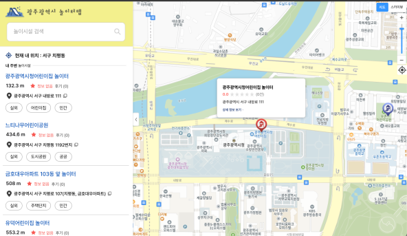
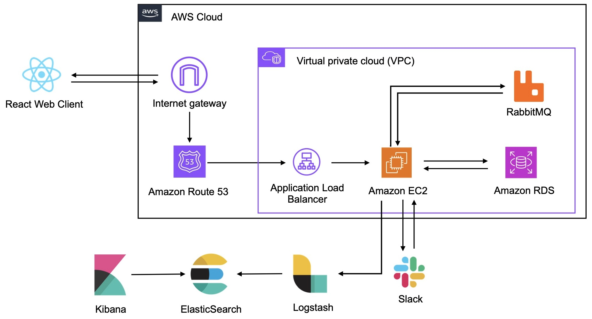

# 광주광역시 놀이터맵

[광주광역시 놀이터맵 바로가기 - https://gj.noritermap.com](https://gj.noritermap.com/)

---
## 🔎 Introduction

- [광주광역시 놀이터맵](https://gj.noritermap.com/)은 광주광역시 내의 전체 어린이 놀이시설(2237개)에 대한 정보를 제공하는 서비스입니다.   
- 지도를 통해 놀이시설의 정확한 위치를 확인할 수 있으며, 주소, 사진, 설치일자, 시설 내 놀이기구, CCTV 개수, 보험가입 여부, 안전검사 여부, 이용자 평점과 후기 등의 상세 정보를 제공합니다.  
- 이 서비스는 광주광역시 빅데이터 통합플랫폼과 공공데이터포털에서 제공하는 [광주광역시_어린이 놀이시설 현황](https://www.data.go.kr/data/15012318/fileData.do), [행정안전부_전국어린이놀이시설정보서비스](https://www.data.go.kr/data/15124521/openapi.do), [행정안전부_전국어린이놀이시설기구정보서비스](https://www.data.go.kr/data/15124521/openapi.do) 데이터를 활용하여 개발되었습니다.   
- 데이터를 정제하고 통합하여 부모님들이 자녀와 함께 안전하고 유익한 놀이시설을 쉽게 찾을 수 있도록 돕는 것이 주요 목적입니다.

---
## 📝 Description

### 📑 초기화면

- 웹 서비스에 접속 시, 이용자의 현재 위치를 기준으로 지도가 자동으로 이동합니다. 
- 사용자는 접속 즉시 현재 위치 주변의 어린이 놀이시설을 바로 확인할 수 있습니다.

### 📑 지도 축소 화면

- 마우스 스크롤을 통해 지도를 축소하면 광주광역시 전체가 한 화면에 나타납니다. 
- 총 2238개의 어린이 놀이시설이 정확한 위치 정보와 함께 지도에 표시됩니다. 
- 각 구역별 놀이시설의 수를 숫자로 확인할 수 있습니다.

### 📑 확대 화면 1

- 지도를 더 확대하면, 더 세분화된 구역의 놀이시설 개수를 확인할 수 있습니다.

### 📑 확대 화면 2

- 지도를 완전히 확대하면, 놀이시설의 정확한 위치가 마커로 표시되어 어디에 놀이시설이 있는지 한 눈에 파악할 수 있습니다.

### 📑 마커 클릭 시 오버레이 표출

- 놀이시설의 마커를 클릭하면, 선택한 시설의 마커 색깔이 빨간색으로 변하며, 마커 상단에 간략한 정보가 표시됩니다. 
- 표시되는 데이터는 시설 이름, 평점, 리뷰 개수, 주소입니다. 
- 상세보기 버튼을 누르면 페이지 왼쪽에 상세 정보 창이 나타납니다.

### 📑 사이드바

- 사용자의 현재 위치를 동 단위까지 표시합니다. 
- 현재 위치정보를 제공하지 않으면, 광주광역시청을 기본 위치로 설정합니다. 
- 사용자는 현재 위치를 기반으로 가장 가까운 놀이시설을 탐색할 수 있습니다. 
- 제공되는 정보는 시설까지의 거리, 평점, 리뷰 개수, 주소, 실내외 구분, 설치 장소, 민공 구분입니다.

### 📑 검색 기능

    
    

- 사용자는 키워드를 바탕으로 놀이시설을 검색할 수 있습니다. 
- 검색 옵션으로 실내외 구분, 설치 장소, 민공 구분을 제공하며, 사용자가 원하는 옵션으로 필터링하여 검색할 수 있습니다.

### 📑 시설 상세

- 검색 화면에서 시설을 클릭하거나, 마커를 클릭한 후 상세보기를 클릭하면 해당 시설에 대한 상세 정보를 제공합니다. 
- 상단에는 해당 시설의 로드뷰를 제공하여 위치와 주변 환경을 확인할 수 있습니다.

### 📑 시설 상세 - 놀이시설 정보

- 놀이시설의 설치일자, 놀이기구와 각 기구의 설치일자, 물놀이형 놀이시설 여부, CCTV 개수, 보험가입 여부, 안전검사 여부 등의 정보를 제공합니다. 
- 최하단의 ‘정보 수정 제안하기’ 버튼을 통해 이용자가 잘못된 정보를 발견했을 때 수정을 요청할 수 있습니다.

### 📑 시설 상세 - 리뷰

- 이용자는 시설에 대한 평점과 리뷰를 등록할 수 있습니다.

---

## 💻 Tools
### 📦 Client
- React 18.3.1
- TypeScript

### 📦 Server
- Java 17, Junit 5
- Spring Boot 3.2.5
- MySQL, RabbitMQ

---

## 🤲 Architecture Diagram

